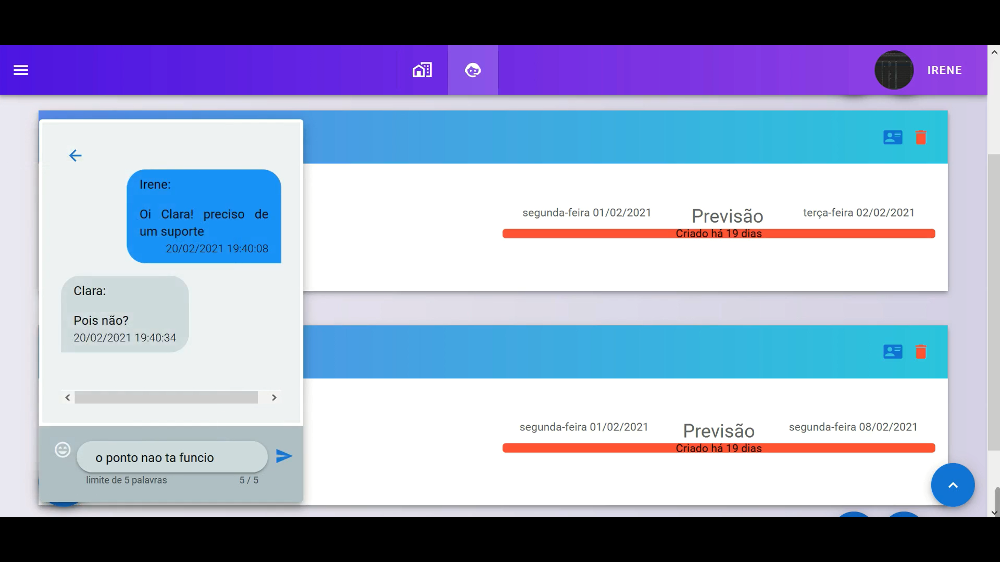
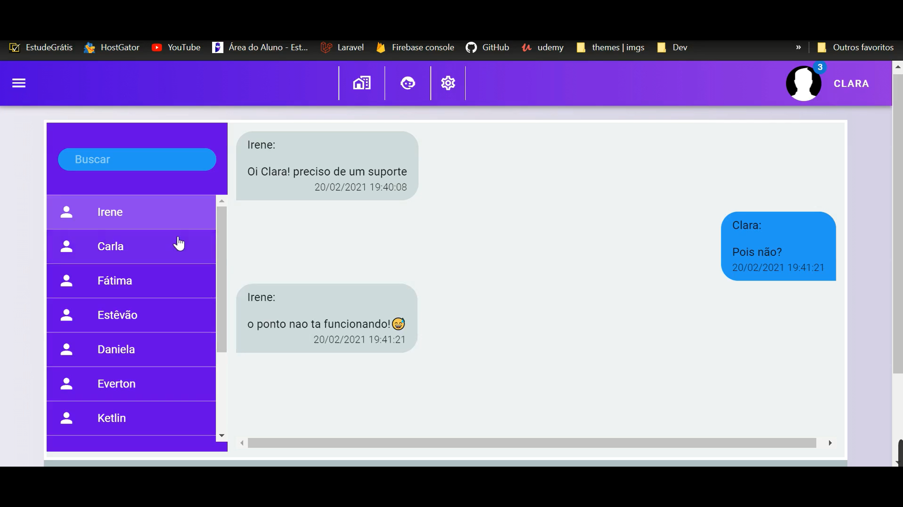

# HelpDesk Ponto Eletrônico
## _Desenvolvido Com Laravel API + VueJS no front_

[](http://131.255.233.6:8000/login)

## Visão Geral
Este HelpDesk é focado em administrar serviços de manutenção de ponto eletrônico de toda uma rede municipal com mais de 11k usuários. Desenvolvido com laravel no back e vue no front, é uma aplicação SPA que atualmente está hospedada em um servidor local e permite acessos via extranet.

## Demonstração

### Abrindo um chamado:



### Chat versão alfa:

#### Chat exclusivo para usuários adminitradores



#### Chat para todos


## Techs

HelpDesk é desenvolvido em duas estruturas distintas (front e back), abaixo estão alguams das bibliotecas utilizadas que auxiliaram no desenvolvimento:

- [Vuejs](https://vuejs.org/) - v2.x e todo seu ecosistema (vue-router, vuex,.. ) + libs externas
- [Laravel] (https://laravel.com/docs/7.x) - v7.x usando seus recursos de API como Passport (Oauth2) + libs externas
- [Laravel-websockets] (https://beyondco.de/docs/laravel-websockets/getting-started/introduction) - lib que gerencia o pusher.
- [laravel-echo] (https://github.com/laravel/echo) - real-time cliente
- [vuetify] (https://vuetifyjs.com/en/) - framework css
- [moment] (https://momentjs.com/) - lib para manipulação de dados do tipo data
- [firebase] (https://firebase.google.com/?gclid=Cj0KCQjwl9GCBhDvARIsAFunhskKHbvsUU9nfW8BaIscCWD0eikzWRXvfmLpke_Bd8HB3OnhkShwSYYaAgRzEALw_wcB&gclsrc=aw.ds) - utilizado para gerenciamento da imagem de perfil

E claro, o próprio HelpDesk é um código aberto com um repositório público
no GitHub.

## Instalação

HelpDesk requer [Node.js](https://nodejs.org/) v12+ para rodar.

Siga as orientações para ambientes de desenvolvimento.
front-end:
```sh
npm i
npm run serve
```
back-end: 
```sh
composer install
php artisan migrate
php artisan db:seed
php artisan passport:install
php artisan serve
php artisan websockets:serve
```

## Docker

Atualmente estou trabalhando em algumas atualizações, nesta, pretendo implantar docker para melhor manutenção e deploy.

## Autor

<a href="https://github.com/DaniloSax.png">
 
 <br />
 <sub><b>Danilo Veloso</b></sub></a> <a href="https://github.com/DaniloSax" title="Rocketseat">🚀</a>


Feito com ❤️ por Danilo Veloso 👋🏽 Entre em contato!

[](https://www.linkedin.com/in/danilo-veloso/) 
[](mailto:danilovsdanilo@gmail.com)


## License

MIT

**Free Software, Hell Yeah!**
